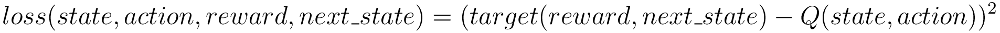

DQN Paper Implementation
========================

This is an unaffiliated implementation of the following papers:

    Mnih, V., Kavukcuoglu, K., Silver, D., Graves, A., Antonoglou, I., Wierstra, D. and Riedmiller, M., 2013. Playing atari with deep reinforcement learning. arXiv preprint arXiv:1312.5602.

    Mnih, V., Kavukcuoglu, K., Silver, D., Rusu, A.A., Veness, J., Bellemare, M.G., Graves, A., Riedmiller, M., Fidjeland, A.K., Ostrovski, G. and Petersen, S., 2015. Human-level control through deep reinforcement learning. nature, 518(7540), pp.529-533.

### Motivation

Prior to Deep Q-Networks (DQN), the field of Reinforcement Learning (RL) had made a lot
of progress in developing a framework for learning from experience, however,
there was a limitation in the effectiveness of the types of function approximators
that were being used at the time. Although linear methods had better convergence
properties under certain assumptions, they didn't necessarily scale to tackle
problems with rich input spaces like vision. With the explosion of deep learning
methods spurred by AlexNet winning the ImageNet challenge, the time was ripe to
apply the kind of deep architectures that were performing well in vision to the RL 
domain.

### Key Contributions

* First deep learning model successfully applied to complex high-dimensional RL problems.
* Outperformed all pervious approaches on 49 Atari 2600 games and was comparable to professional human games testers.

### Approach

DQN uses an objective very similar to the well known Q-learning objective function which is formulated as follows:

<!--

    target(reward, next\_state) = reward + discount\_factor * max_{a} \{Q(next\_state, a)\}

    loss(state, action, reward, next\_state) = (target(reward, next\_state) - Q(state, action))^2

-->

The Q function, however, is represented as a deep convolution network and optimization
is performed using backpropagation. Additionally, two important details were found to
stabilize the learning process due to the fact that the objective is non-stationary.

1. A replay buffer which stored a history of the tuples 
(state, action, reward, next state, next state is terminal state)
was used to sample mini-batches from and formulate the objective
function.

2. A target Q network clone was used to formulate the target instead of
the Q function being sampled from.

### Implementation

This implementation is for the most part the same as described in the original paper.
There were a few changes that were made to the deep convolutional network used as well
as the loss function and hyperparameters that were trained on. 
The Q-network was modified to use batch normalization and ELU activations 
to speed up learning. Additionally, during preprocessing, the input shape to the network was configurable 
and no central cropping was applied, only resizing. Lastly, a huber loss was used instead 
of MSE to better handle outliers.